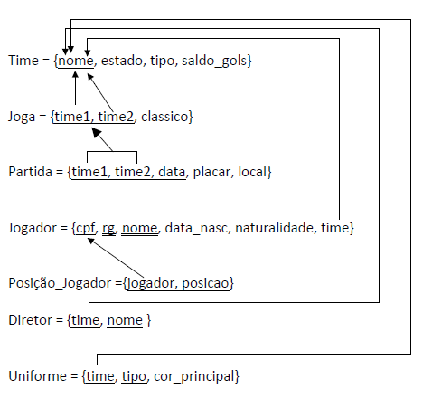

# Exercícios de desenvolvimento

Considere o esquema a seguir, e as restrições semânticas conhecidas:

- o tipo do Time só pode assumir os valores 'AMADOR' e 'PROFISSIONAL';
- o atributo classico de Joga indica se o jogo é um clássico ou não;
- um jogador deve obrigatoriamente atuar em um time;
- o tipo do Uniforme pode ser 'TITULAR' ou 'RESERVA';
- o placar inicial (default) de uma partida é sempre 0X0;



1. Crie o esquema da base de dados (tabelas) de acordo com o esquema lógico acima.
    - crie todas as tabelas
    - defina todas as restrições de integridade e semânticas necessárias
      - dica: para o atributo de placar, faça check de verificação de formato.
    Pesquise REGEXP_LIKE
    - defina os atributos que podem e que não podem assumir valor nulo;
    - defina valores default
    - defina as ações apropriadas associadas a operações de remoção de tuplas referenciadas por chaves estrangeiras (ON DELETE)

2. Faça algumas inserções/atualizações/remoções de dados nas tabelas:
   - use TO_DATE() para inserção de datas
   - teste as restrições (inserções com sucesso e inserções com erros)
   - faça a seguinte inserção:
     - 1 time de SP
     - 1 time do RJ
     - 1 jogador para cada um desses times
     - 1 partida entre esses dois times
   - remova da tabela Time o time de SP (usando o estado como condição de localização); quais tabelas foram afetadas, e como?

3. Faça as seguintes alterações no esquema da base de dados:
    - a) insira, na tabela Jogador, o atributo atômico endereço, que poderá assumir valor nulo. O que aconteceu nas tuplas já existentes na tabela?
    - b) faça o mesmo teste para um novo atributo qualquer com valor default.
    - c) escolha uma tabela e crie uma nova constraint do tipo check, de modo que os valores já existentes na tabela não atendam à nova restrição (faça as inserções necessárias para teste antes da criação da nova constraint). Pesquise o funcionamento do check no Oracle e teste as possibilidades (dica: novalidate).
    - d) para as tabelas **Jogador** e **Posicao_Jogador**:
        1. insira pelo menos 2 tuplas em cada tabela;
        2. usando a interface do SQL Developer, veja a estrutura das tabelas, constraints, índices criados para cada uma delas elas e dados inseridos (double click no nome da tabela – na hierarquia do lado esquerdo - abre abas no lado direto com todas as informações)
        3. remova da tabela Jogador o atributo CPF. Qual o efeito disso (estrutura e dados) em Posicao_Jogador?

---

## Exercicio 1

```SQL
CREATE TABLE TIME (
    NOME VARCHAR2(30) NOT NULL,
    ESTADO VARCHAR2(30) NOT NULL,
    TIPO VARCHAR2(30) NOT NULL
                    CHECK (TIPO IN ('AMADOR', 'PROFISSIONAL')),
    SALDO_GOLS NUMBER(3) DEFAULT 0,
    PRIMARY KEY (NOME)
);  

CREATE TABLE JOGA (
    TIME1 VARCHAR2(30) NOT NULL,
    TIME2 VARCHAR2(30) NOT NULL,
    CLASSICO NUMBER(1) NOT NULL,
    PRIMARY KEY (TIME1, TIME2),
    CONSTRAINT CHECK_CLASSICO CHECK (CLASSICO IN (0, 1)),
    CONSTRAINT FK_JOGA_1 FOREIGN KEY (TIME1) REFERENCES TIME (NOME)
    ON DELETE CASCADE,
    CONSTRAINT FK_JOGA_2 FOREIGN KEY (TIME2) REFERENCES TIME (NOME)
    ON DELETE CASCADE
);

CREATE TABLE PARTIDA (
    TIME1 VARCHAR2(30) NOT NULL,
    TIME2 VARCHAR2(30) NOT NULL,
    DATA DATE NOT NULL,
    PLACAR VARCHAR2(30) DEFAULT '0x0'
                        CHECK (REGEXP_LIKE(PLACAR,'^[0-9]+x[0-9]+$')),
    LOCAL VARCHAR2(30) NOT NULL,
    PRIMARY KEY (TIME1, TIME2, DATA),
    CONSTRAINT FK_PARTIDA FOREIGN KEY (TIME1, TIME2) REFERENCES JOGA (TIME1, TIME2) ON DELETE CASCADE
);

CREATE TABLE JOGADOR (
    CPF VARCHAR2(30) NOT NULL,
    RG VARCHAR2(30) NOT NULL,
    NOME VARCHAR2(30) NOT NULL,
    DATA_NASC DATE NOT NULL,
    NATURALIDADE VARCHAR2(30) NOT NULL,
    TIME VARCHAR2(30) NOT NULL,
    PRIMARY KEY (CPF),
    UNIQUE (RG, NOME),
    CONSTRAINT FK_JOGADOR FOREIGN KEY (TIME) REFERENCES TIME (NOME)
);

CREATE TABLE POSICAO_JOGADOR (
    JOGADOR VARCHAR2(30) NOT NULL,
    POSICAO VARCHAR2(30) NOT NULL,
    PRIMARY KEY (JOGADOR, POSICAO),
    CONSTRAINT FK_POSICAO_JOGADOR FOREIGN KEY (JOGADOR) REFERENCES JOGADOR (CPF) ON DELETE CASCADE 
);

CREATE TABLE DIRETOR (
    TIME VARCHAR2(30) NOT NULL,
    NOME VARCHAR2(30) NOT NULL,
    PRIMARY KEY (TIME, NOME),
    CONSTRAINT FK_DIRETOR FOREIGN KEY (TIME) REFERENCES TIME (NOME)
    ON DELETE CASCADE
);

CREATE TABLE UNIFORME (
    TIME VARCHAR2(30) NOT NULL,
    TIPO VARCHAR2(30) NOT NULL
                    CHECK (TIPO IN ('TITULAR', 'RESERVA')),
    COR_PRINCIPAL VARCHAR2(30) NOT NULL,
    PRIMARY KEY (TIME, TIPO),
    CONSTRAINT FK_UNIFORME FOREIGN KEY (TIME) REFERENCES TIME (NOME)
    ON DELETE CASCADE
);

```

---

## Exercicio 2

```SQL
----- Inserção de dados -----

-- Times profissionais
INSERT INTO TIME VALUES ('Corinthians', 'SP', 'PROFISSIONAL', 0);
INSERT INTO TIME VALUES ('Flamengo', 'RJ', 'PROFISSIONAL', 0);

-- Uniformes dos times
INSERT INTO UNIFORME VALUES ('Corinthians', 'TITULAR', 'BRANCO');
INSERT INTO UNIFORME VALUES ('Corinthians', 'RESERVA', 'PRETO');

INSERT INTO UNIFORME VALUES ('Flamengo', 'TITULAR', 'VERMELHO');
INSERT INTO UNIFORME VALUES ('Flamengo', 'RESERVA', 'PRETO');

-- Diretores dos times
INSERT INTO DIRETOR VALUES ('Flamengo', 'Zé');
INSERT INTO DIRETOR VALUES ('Corinthians', 'Cláudio');

-- Jogadores 
INSERT INTO JOGADOR VALUES ('123456789-00', '123456789', 'João', TO_DATE('01/01/1991', 'DD/MM/YYYY'), 'Rio de Janeiro', 'Flamengo');
INSERT INTO JOGADOR VALUES ('123456789-01', '123456789', 'Pedro', TO_DATE('01/01/1987', 'DD/MM/YYYY'), 'São Paulo', 'Corinthians');

-- Posições dos jogadores
INSERT INTO POSICAO_JOGADOR VALUES ('123456789-00', 'Atacante');
INSERT INTO POSICAO_JOGADOR VALUES ('123456789-01', 'Atacante');

-- Joga
INSERT INTO JOGA VALUES ('Flamengo', 'Corinthians', 1);

-- Partida
INSERT INTO PARTIDA VALUES ('Flamengo', 'Corinthians', TO_DATE('01/01/2019', 'DD/MM/YYYY'), '0x0', 'Maracanã');

```

```SQL
----- Atualização de dados -----

-- Atualização de saldo de gols
UPDATE PARTIDA 
    SET PLACAR = '1x0' 
    WHERE TIME1 = 'Flamengo' AND TIME2 = 'Corinthians';
UPDATE TIME 
    SET SALDO_GOLS = SALDO_GOLS + 1 
    WHERE NOME = 'Flamengo';

UPDATE PARTIDA 
    SET PLACAR = '2x0' 
    WHERE TIME1 = 'Flamengo' AND TIME2 = 'Corinthians';
UPDATE TIME 
    SET SALDO_GOLS = SALDO_GOLS + 1 
    WHERE NOME = 'Flamengo';

```

```SQL
----- Inserção com restrições de integridade -----

-- Não é possível inserir um jogador em um time que não existe
INSERT INTO JOGADOR VALUES ('123456789-03', '123456789', 'João', TO_DATE('01/01/1991', 'DD/MM/YYYY'), 'Rio de Janeiro', 'São Paulo');

-- Não é possível inserir um jogador com o mesmo CPF
INSERT INTO JOGADOR VALUES ('123456789-00', '123456789', 'João', TO_DATE('01/01/1991', 'DD/MM/YYYY'), 'Rio de Janeiro', 'Flamengo');

-- Não é possível inserir um jogador com o mesmo RG e nome
INSERT INTO JOGADOR VALUES ('123456789-03', '123456789', 'João', TO_DATE('01/01/1991', 'DD/MM/YYYY'), 'Rio de Janeiro', 'Flamengo');

```

```SQL
----- Exclusão de dados com e sem restrições de integridade -----

-- Exclusão do time de SP utilizando estado como condição de localização
DELETE FROM TIME 
    WHERE LOCALIZACAO = 'SP';

```

A Exclusão a cima não é permitida porque a tabela Jogador possui a condição de restrição de integridade ON DELETE RESTRICT, ou seja, não é possível excluir um time que possui jogadores e todo jogador deve pertencer a um time.

Desta forma, é necessário excluir os jogadores do time ou alterar o time de cada jogador para que seja possível excluir o time.

```SQL
DELETE FROM JOGADOR 
    WHERE TIME = 'Corinthians';

DELETE FROM TIME 
    WHERE LOCALIZACAO = 'SP';

```

A Exclusão a cima agora é executada com sucesso, pois os jogadores do time de SP foram excluídos antes.

Como resultado dessa ação, as Tabelas que possuem a condição de restrição de integridade ON DELETE CASCADE e que possuem uma chave estrangeira que referencia a chave primária da tabela Time, também são excluídas.

Do exemplo a cima, as tabelas DIRETOR, UNIFORME, JOGA, PARTIDA são  excluídas, pois possuem uma chave estrangeira que referencia a chave primária da tabela Time.

A tabela POSICAO_JOGADOR é excluida também, porque os jogadores do time de SP foram excluídos.

### Observações sobre a exclusão de dados

A exclusão de dados é feita utilizando a cláusula DELETE FROM, que recebe como parâmetro o nome da tabela e a condição de exclusão.

Esta condição de exclusão de preferência deve ser feita utilizando a chave primária da tabela, pois assim a exclusão é feita de forma mais rápida e também não haverá o risco de excluir dados que não deveriam ser excluídos.

O Exemplo a cima, o qual exclui o time de SP, foi feito utilizando a condição de exclusão utilizando a localização do time, o que não é uma boa prática, nesse contexto está tudo bem, pois, o time de SP é o único que possui a localização SP, mas em outros casos, pode ser que existam mais de um time com a mesma localização, e nesse caso, a exclusão de todos os times com a mesma localização, não é o que se deseja.

---

## Exercicio 3

a) Insira, na tabela Jogador, o atributo atômico endereço, que poderá assumir valor nulo. O que aconteceu nas tuplas que já existentes na tabela?

```SQL
-- Inserindo na tabela Jogador o atributo atômico endereço
ALTER TABLE JOGADOR
    ADD ENDERECO VARCHAR2(100);

```

Ao efetuar a alteração da tabela jogador, o Oracle adiciona o atributo endereço em todas as tuplas da tabela, porém, como o atributo endereço é nulo, o Oracle adiciona o valor NULL em todas as tuplas.

b) Faça o mesmo teste para um novo atributo qualquer com valor default.

```SQL
ALTER TABLE JOGADOR
    ADD SALARIO NUMBER DEFAULT 0;

```

Ao efetuar a alteração da tabela jogador, o Oracle adiciona o atributo salario em todas as tuplas da tabela, porém, como o atributo salario é nulo, o Oracle adiciona o valor 0 em todas as tuplas.

c) escolha uma tabela e crie uma nova constraint do tipo check, de modo que os valores já existentes na tabela não atendam à nova restrição (faça as inserções necessárias para teste antes da criação da nova constraint).

```SQL
UPDATE JOGADOR
    SET SALARIO = -1;
    WHERE CPF = '123456789-00';

UPDATE JOGADOR
    SET SALARIO = 10;
    WHERE CPF = '123456789-01';

-- Criando uma nova constraint do tipo check
ALTER TABLE JOGADOR
    ADD CONSTRAINT CHECK_SALARIO CHECK (SALARIO > 0);
```

Ao efetuar a alteração da tabela jogador, o Oracle adiciona a constraint check_salario em todas as tuplas da tabela, como há tuplas que não atendem a condição da constraint, o Oracle não permite a inserção da constraint.

Caso ativemos o NOVALIDATE na criação da constraint, o Oracle não irá validar a condição da constraint, e a constraint será criada.

```SQL
ALTER TABLE JOGADOR
    ADD CONSTRAINT CHECK_SALARIO CHECK (SALARIO > 0) NOVALIDATE;
```

O comando a cima é executado com sucesso e as tuplas que não atendem a condição da constraint, continuam com o valor anterior.

d) Com base na tabela Jogador e Posicao_jogador

i) Insira pelo menos duas tuplas em cada tabela

```SQL
INSERT INTO JOGADOR VALUES ('123456789-02', 'João', 'Rua 1', 1000, 'Corinthians');
INSERT INTO JOGADOR VALUES ('123456789-03', 'Kleber', 'Rua 2', 2000, 'Flamengo');

INSERT INTO POSICAO_JOGADOR VALUES ('123456789-02', 'Atacante');
INSERT INTO POSICAO_JOGADOR VALUES ('123456789-03', 'Goleiro');
```

ii) Não consigo realizar essa questão, pois não consegui executar o SQL Developer

iii) remova da tabela Jogador o atributo CPF, qual o efeito disso em Posicao_Jogador?

```SQL
ALTER TABLE JOGADOR
    DROP COLUMN CPF;
```

Ao remover o atributo CPF da tabela Jogador, o Oracle remove o atributo CPF da tabela Posicao_Jogador, pois a tabela Posicao_Jogador possui uma chave estrangeira que referencia a chave primária da tabela Jogador.
